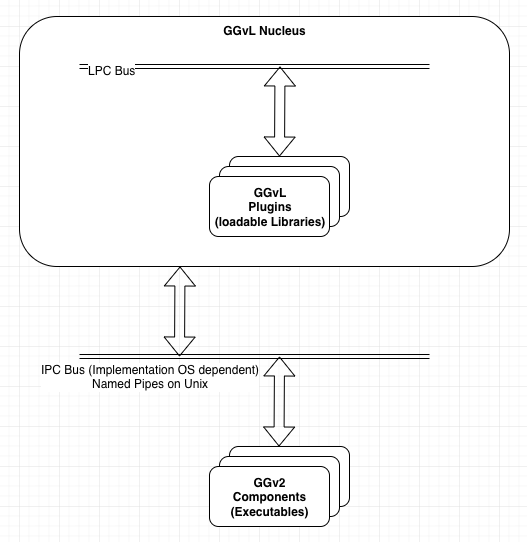

# Nucleus Requirements

## Abbreviations and Jargon
1. GG-Java : The existing Greengrass v2 in Java.
2. GG-Lite : The new implementatyion of Greengrass v2 in C++.
3. Nucleus : The executable core of Greengrass.
4. 

## Background
GG-Lite is an application called Nucleus that manages plugins & libraries.  To facilitate communications between plugins
the Nucleus provides the Local Process Communications (LPC) bus.  To facilitate communications between components the
Nucleus provides the Interprocess Communications (IPC) bus.  Plugins are libraries (details are OS specific) that
Nucleus loads at runtime according to a recipe.  Plugins are authenticated as they are installed and as they load.
Once loaded they are trusted entities and are safe to execute inside the Nucleus process.

>TODO: Fix the abbreviations in this diagram.
> 

## Nucleus functionality
Nucleus has the following functions:
1. Lifecycle management of plugins
   1. Locate Plugins (_Temporary until plugin deployment is ready_)
   2. Install Plugins
   3. Load Plugins
   4. Run Plugins
   5. Unload Plugins
   6. Update Plugins
   7. Delete Plugins
2. Provide a Lifecycle API interface to the Plugin
3. Distribute messages on the IPC bus
4. Provide an API for the plugins to access the IPC bus
5. Specify the IPC bus message format
5. Distribute messages on the LPC bus
6. Provide an API for plugins to access the LPC bus
7. String Internment
8. 

## IPC Message Distribution Requirements

## IPC Message Format Requirements

### 1.0 

IPC message formatting conforms to the following specification: https://quip-amazon.com/aECHAUcJkIk8/IPC-as-is-2022#temp:C:QcL33a7ae991c1c44709189e52af
> This specification needs to be updated to a public facing document.

## LPC Message Distribution Requirements

## LPC Authentication Requirements

## LPC Message Format Requirements

## String Internment Requirements

